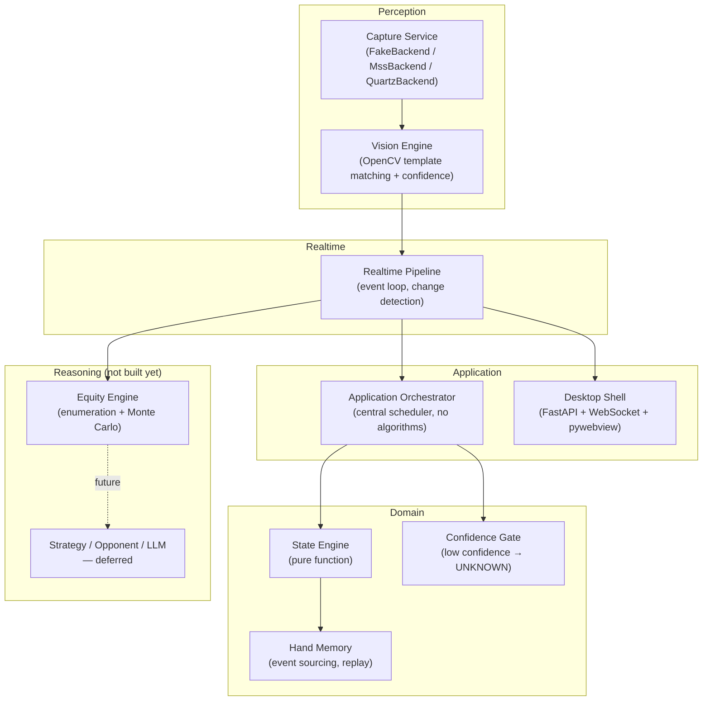

# PokerSense

**English** | [简体中文](README.zh-CN.md)

**A real-time Texas Hold'em analysis assistant.** It watches a poker table (via screen
capture), recognizes the game state, computes equity, and shows the result in a live
desktop companion window — so a player can see win rate, street, and confidence while
they play.

It is **not** an autoplay bot, and it does not place bets or make decisions on the
player's behalf. It observes and reports; the human still plays every hand. It also does
not do hand-history replay analysis — everything here is real-time, frame by frame.

---

## What actually works today

This section is deliberately literal — every claim below has been independently run and
verified on real hardware, not just implemented and assumed correct.

| Capability | Status | Evidence |
|---|---|---|
| Core domain model (immutable value objects, `ChipAmount`/`ChipDelta`, event sourcing) | ✅ Done | 560+ unit tests |
| State Engine (pure-function state machine) | ✅ Done | unit + integration tests |
| Equity Engine (enumeration + Monte Carlo + pot odds + ranges) | ✅ Done | enumeration and Monte Carlo cross-validated to agree at showdown |
| Confidence Gate (low-confidence fields degrade to `UNKNOWN`, never guessed) | ✅ Done | unit tests |
| Screen capture — Windows (`MssBackend`) | ✅ Implemented | unit-tested; not yet run against a real Windows desktop |
| Screen capture — macOS (`QuartzBackend`) | ✅ Implemented and verified | captured a real on-screen window on real hardware |
| Vision recognition (OpenCV template matching: cards, street, pot) | ✅ Verified against real pixels | see [Real-world vision proof](#real-world-vision-proof) below |
| Realtime pipeline (Capture → Vision → State → Equity, one event loop) | ✅ Working | wired and run end to end, driven by a real capture |
| Desktop UI (companion window, live-updating) | ✅ Working | FastAPI + WebSocket backend, HTML/CSS/JS frontend, verified live |
| Packaging (macOS `.dmg`, Windows installer `.exe`, via GitHub Actions) | ✅ Working | CI builds and a tagged release both succeeded |
| Hero-card recognition on a real platform (WePoker H5) | ✅ Calibrated and measured | 48/48 on held-out real captures — see [Real-platform calibration](#real-platform-calibration) |
| Board cards / pot / street on a real platform | ❌ Not done | only the hero-card region has been calibrated so far |
| Strategy / opponent modeling / LLM reasoning / decision output | ❌ Not started | intentionally deferred — see [Roadmap](#roadmap) |

### Real-world vision proof

Every prior "accuracy" number for the Vision Engine was measured against synthetic,
generator-drawn images — never a real screenshot. To find out whether the recognition
code actually works on real pixels, we rendered a controlled test table
(`tools/real_pipeline_smoke/mock_table.html`), captured it as a genuine on-screen macOS
window, and ran the unmodified `VisionEngine` against that capture:

```
hero_cards : Ah, Kh    ✓ correct, confidence 0.95
board_cards: Qh 9h 2c 5h 7s   ✓ correct, confidence 0.95
street     : RIVER     ✓ correctly derived from board occupancy
pot        : 42        ✓ correct, confidence 0.95
```

This is real evidence, not synthetic self-validation — but it is **not** evidence about
any specific real poker client's card skin, layout, or rendering. That step is covered
separately, below.

### Real-platform calibration

Calibrated against a live **WePoker H5** table: real screen captures via
`QuartzBackend`, hero-card ROIs measured from those captures
(`configs/platform/wepoker__h5_2max.json`), and rank/suit templates cut from real card
art (`configs/vision/wepoker/`).

Measured on 62 real card captures with verified ground truth, then re-measured with
every template-source image excluded:

| Metric | Whole-card matching | Corner-glyph matching |
|---|---|---|
| Rank | 98.1% | **100%** |
| Suit — red (♥♦) | 95.7% | **100%** |
| Suit — black (♣♠) | 48.3% | **100%** |
| Full card | 67.3% | **100%** |

Held-out result: **48/48** (25 distinct cards, 30 of them black-suited).

The 48% black-suit score was not noise — clubs and spades collapsed into each other
almost one-directionally. Two concrete causes, both found by inspecting the actual
pixels rather than tuning thresholds:

1. Slicing the card corner at a fixed offset cut into the bottom of the rank glyph and
   truncated the suit glyph, so every template carried a fragment of an unrelated digit.
2. The large centre pip bleeds into the same x-range as the corner index, which made the
   club template wider than the spade template; `matchTemplate` then rescaled one to the
   other's aspect ratio, destroying the shape difference it was supposed to measure.

[`corner_glyph_recognizer.py`](src/poker_engine/perceptual/vision/corner_glyph_recognizer.py)
fixes both by locating glyphs with connected components instead of fixed offsets,
rejecting table felt by colour, and letterboxing every glyph onto a fixed grid before
matching. It's a separate `CardRecognizer` Protocol implementation, so it plugs in
without touching the sealed template matcher.

Regression tests run against committed real-capture fixtures
(`tests/vision/fixtures/wepoker/`), all of them held-out samples.

---

## Architecture

Five layers, strictly one-way dependency (nothing depends on anything above it):



**Design principle, in priority order: correctness > stability > observability >
performance > feature count.** Concretely: money is always `decimal.Decimal`, never
`float`; every state object is deep-immutable; a field the Vision Engine isn't confident
about becomes `UNKNOWN`, never a guess; every recognizer's occupancy/identity evidence is
independently derived and reconciled, not conflated.

See [`architecture.md`](architecture.md) for the full design doc (data contracts, the
Fast/Slow path split for the future reasoning layer, and the reasoning behind each rule
above).

### Data flow, end to end

```
Screen  →  Capture Service  →  Frame
                                  │
                                  ▼
                          Vision Engine  →  RawObservation (cards, street, pot + confidence)
                                  │
                                  ▼
                        Realtime Pipeline  →  change detection (only recompute on real change)
                                  │
                    ┌─────────────┴─────────────┐
                    ▼                             ▼
        Application Orchestrator          Equity Engine
         → State Engine → new state         (win rate / tie rate)
                    │                             │
                    └─────────────┬─────────────┘
                                  ▼
                     RealtimeAnalysis (state + equity + confidence)
                                  │
                                  ▼
                    WebSocket  →  Desktop companion window
```

---

## Module map

| Module | Path | What it owns |
|---|---|---|
| Core | `src/poker_engine/core/` | Immutable domain types: `PokerState`, `Card`, `ChipAmount`/`ChipDelta`, events. Zero third-party runtime dependencies. |
| State Engine | `src/poker_engine/state_engine/` | Pure-function state transitions; rejects illegal/regressive state. |
| Hand Memory | `src/poker_engine/memory/` | Append-only event store; a hand can be fully replayed from it. |
| Confidence | `src/poker_engine/confidence/` | Gates low-confidence fields to `UNKNOWN` before they can drive a decision. |
| Orchestrator | `src/poker_engine/orchestrator/` | Central scheduler; the only module that calls into State + Hand Memory together. Contains no algorithms. |
| Perceptual — Capture | `src/poker_engine/perceptual/capture/` | `FakeBackend` (tests), `MssBackend` (Windows), `QuartzBackend` (macOS) — all implement the same `CaptureService` interface. |
| Perceptual — Vision | `src/poker_engine/perceptual/vision/` | Card/street/pot recognizers (OpenCV template matching), ROI mapping, per-detector confidence calibration. |
| Equity | `src/poker_engine/equity/` | Hand evaluator, enumeration, Monte Carlo, pot odds, range equity. |
| Realtime | `src/poker_engine/realtime/` | The event loop tying capture → vision → state → equity together, with change detection so idle frames don't trigger recompute. |
| Desktop | `src/poker_engine/desktop/` | FastAPI server (serves the UI, streams `RealtimeAnalysis` over WebSocket) + a `pywebview` native window shell. |
| UI | `ui/` | The companion window itself — plain HTML/CSS/JS, no build step, no external dependencies. |

Deeper design docs live in [`docs/`](docs/): `core-contracts.md`, `state-engine.md`,
`vision-engine.md`, `confidence-gate.md`, `hand-memory.md`, `orchestrator.md`,
`capture-and-table-mapping.md`, `serialization.md`, `tech-stack-matrix.md`, plus
architecture decision records in [`docs/adr/`](docs/adr/).

---

## How recognition actually works today (and an open question)

Recognition in `src/poker_engine/perceptual/vision/` is three layers, and it's important
to be precise about which parts generalize across poker platforms and which don't.

1. **Where things are — `TableMap` / ROI.** A per-platform JSON config of normalized
   (0–1) rectangles: where the hero cards are on screen, where the board is, where the
   pot text is. Normalized so it survives resolution changes on the *same* platform. This
   config is calibrated once, by hand, per platform+layout — there's no way around that;
   every poker client lays out its table differently.
2. **Whether a slot has a card — `TemplateBoardSlotDetector`.** Pure pixel statistics
   (brightness × edge-texture density), no knowledge of *which* card. This part is
   already platform-agnostic — a bright, textured region reads as "occupied" regardless
   of art style.
3. **Which card it is — `TemplateCardRecognizer`.** OpenCV template matching: crop the
   slot, compare against 13 rank templates and 4 suit templates via
   `cv2.matchTemplate`, take the best score. **This is the part that's actually
   platform-specific** — the templates are pixel crops taken from one specific
   platform's card art. A different card skin/font means the templates stop matching
   (verified the hard way today: a loosely-cropped template scored 0.16 vs. 0.97 for a
   tightly-cropped one of the *same* glyph — this approach is that sensitive to exact
   pixel content).

So: layout detection and occupancy detection are already general-purpose; card identity
is not — it's bound to whatever screenshots the templates were cut from.

The current decision is **calibrate per platform**, starting with WePoker (done for hero
cards — see [Real-platform calibration](#real-platform-calibration)). Adding a platform
means capturing its table, measuring ROIs, and cutting ~17 glyph templates from its card
art; the recognizer code itself is unchanged.

**The longer-term open question** is whether recognition should generalize to arbitrary
platforms with no calibration at all. The realistic way there is a vision-language model
(VLM) — prompt a multimodal model with the frame and ask what the cards/pot are, instead
of pixel-matching. That generalizes across skins with no calibration step, at the cost of
latency (hundreds of ms to seconds vs. ~12ms today), a per-call cost, a network
dependency, and less deterministic output. The architecture already reserves a slot for
exactly this: the Fast/Slow path split (`architecture.md` §4) was designed for
"cache/deterministic path now, LLM/Solver path later" — a VLM recognizer is a natural
Slow Path candidate, not a rewrite of the Fast Path.

---

## Quick start

Requires Python 3.11.x (pinned — see `pyproject.toml`).

```bash
# Core engine + tests
pip install -e ".[dev]"
make test
make lint

# Screen capture (adds mss on Windows, pyobjc/Quartz on macOS)
pip install -e ".[dev,perceptual]"

# Desktop app (adds FastAPI, uvicorn, pywebview)
pip install -e ".[dev,desktop]"
make run-desktop           # opens the native companion window
make run-desktop-server    # server only, open http://127.0.0.1:8765 in a browser

# Package into a standalone app (adds PyInstaller)
pip install -e ".[dev,desktop,packaging]"
make package                # -> dist/PokerSense.app (macOS) or dist/PokerSense/ (Windows)
```

Right now the desktop app streams a **scripted demo hand**, not live recognition — there
is no real capture pipeline wired into it yet (see [Roadmap](#roadmap)). The point of
today's build is that every piece of the pipeline is real and independently verified;
connecting them end-to-end against a live table is the next step, not a finished one.

CI (`.github/workflows/ci.yml`) runs the full test suite + lint on both macOS and Windows
on every push. `.github/workflows/build-desktop.yml` builds a proper installer for each
platform — a `.dmg` on macOS (signed + notarized if the Apple Developer secrets are
configured, unsigned otherwise) and a `PokerSense-Setup.exe` on Windows (via Inno Setup)
— and attaches both to a GitHub Release on a version tag (`git tag v0.1.0 && git push
origin v0.1.0`).

---

## Roadmap

Deliberately sequenced so nothing gets built on an unproven foundation:

1. **Finish real-platform calibration** — hero cards are done (see above). Board cards,
   pot amount, and street detection still need ROI calibration and accuracy measurement
   against a real table.
2. **Wire the desktop app to live capture** — replace the scripted demo stream with the
   real `RealtimePipeline`, so the companion window shows a real, currently-playing hand.
3. **Equity performance** — the Monte Carlo path is the latency bottleneck (pure Python,
   a few hundred ms); replace with a C-level evaluator or vectorize.
4. **Strategy / opponent modeling / decision output** — intentionally last. Giving action
   advice before recognition is proven reliable is a real risk (see `architecture.md`'s
   "strategy comes after correctness" rule) — Vision has to be trustworthy first.
5. **Distribution** — signed/notarized builds, auto-update, multi-platform card-skin
   support via the `configs/platform/` adapter pattern.

---

## Project conventions

- Money is always `decimal.Decimal` via `ChipAmount` (non-negative) / `ChipDelta`
  (signed) — never `float`.
- Timestamps are always timezone-aware `datetime`; no falsy-fallback patterns.
- Core domain objects are deep-immutable (`tuple`, `frozenset`, `MappingProxyType`, no
  mutable containers leak out).
- A field the Vision Engine can't confidently read becomes `UNKNOWN`, not a guess — it's
  better to show nothing than to show something wrong.
- No AI-agent process ceremony (task plans, self-check reports, versioned result
  snapshots) lives in this repo — git history is the source of truth for what changed and
  why; commit messages carry that context.
