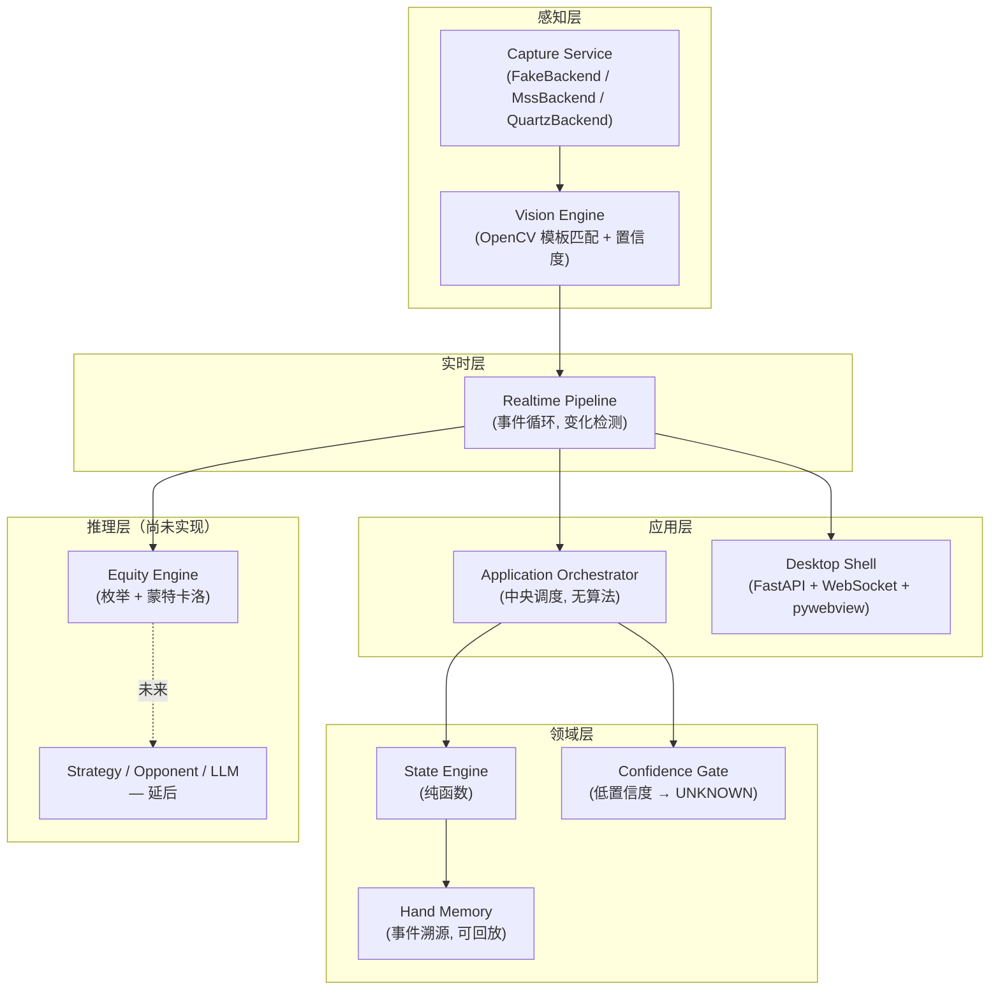

# PokerSense

[English](README.md) | **简体中文**

**一个实时德州扑克分析助手。** 它通过截屏观察牌桌，识别当前局面，计算胜率，并把结果实时显示在一个
桌面伴随窗口里——让玩家在打牌的同时就能看到胜率、街道（street）和识别置信度。

它**不是**自动打牌机器人，不会替玩家下注或做决策——它只观察和汇报，每一手牌都由真人自己打。它也不
是录像回放分析工具——这里的一切都是实时的，逐帧进行。

---

## 现在真正做到了什么

这一节故意写得很直白——下面每一条结论都是在真实硬件上独立跑通验证过的，不是"写完了就当它对"。

| 能力 | 状态 | 证据 |
|---|---|---|
| Core 领域模型（不可变值对象、`ChipAmount`/`ChipDelta`、事件溯源） | ✅ 完成 | 560+ 单元测试 |
| State Engine（纯函数状态机） | ✅ 完成 | 单元 + 集成测试 |
| Equity Engine（枚举 + 蒙特卡洛 + pot odds + 范围） | ✅ 完成 | 枚举法与蒙特卡洛在摊牌结果上交叉验证一致 |
| Confidence Gate（低置信度字段降级为 `UNKNOWN`，绝不瞎猜） | ✅ 完成 | 单元测试 |
| 截屏后端 — Windows（`MssBackend`） | ✅ 已实现 | 单元测试通过；尚未在真实 Windows 桌面上跑过 |
| 截屏后端 — macOS（`QuartzBackend`） | ✅ 已实现并验证 | 在真实硬件上截取过真实的屏幕窗口 |
| 视觉识别（OpenCV 模板匹配） | ✅ 已用真实像素验证 | 见下方 [真实平台标定](#真实平台标定) |
| 实时链路（Capture → Vision → State → Equity，单一事件循环） | ✅ 可运行 | 由真实截屏驱动，端到端跑通 |
| 桌面 UI（伴随窗口，实时刷新） | ✅ 可运行 | FastAPI + WebSocket 后端，HTML/CSS/JS 前端，已验证实时生效 |
| 桌面 App 由**真实截屏**驱动 | ✅ 针对一张真实截图验证通过 | 识别底牌并计算真实胜率——App 里没有任何写死的演示数据 |
| 打牌过程中的持续实时截屏 | ✅ 可用（当前 Space） | 同名窗口可显式选择；牌桌必须在当前活动的 macOS Space |
| 打包（macOS `.dmg`、Windows 安装包 `.exe`，通过 GitHub Actions） | ✅ 可运行 | CI 构建与打 tag 发布均已成功 |
| 真实平台底牌识别（WePoker H5） | ✅ 已标定并实测 | 留出样本 48/48 全对——见 [真实平台标定](#真实平台标定) |
| 真实平台的公共牌 / 底池 / 街道识别 | ❌ 未完成 | 目前只标定了底牌区域 |
| 策略建议 / 对手画像 / LLM 推理 / 决策输出 | ❌ 未开始 | 有意延后，见 [路线图](#路线图) |

### 置信度是"挣来的"，不是"定出来的"

识别器打出 62/62 **并不等于证明了 100% 准确率**——这个样本量下，95% 置信下界约为 95.8%，
声称更高就是在编造证据。所以每个字段报出的置信度是从它自己的实测记录里**推导**出来的，
而不是手工填的：
[`configs/vision/wepoker/calibration.json`](configs/vision/wepoker/calibration.json)
记录了样本数、正确数，以及区分"可读牌面"和"非牌面"的原始分数间隙（实测：非牌面 ≤0.335，
真实牌面 ≥0.664）。`MeasuredCalibration` 据此同时算出校准后的置信度和弃权阈值，
置信度门禁的阈值也取同一个数。

实际后果是：**想提高门槛，唯一的办法是采集更多经过核对的样本**；而没有任何人测量过的字段
（公共牌、底池、街道）阈值被设为 1.0——不可能达到——所以它们只会保持 `UNKNOWN`，
不会去蹭底牌那份测量的可信度。

### 真实平台标定

已针对真实的 **WePoker H5** 牌桌完成标定：通过 `QuartzBackend` 真实截屏，从真实截图中量出底牌
ROI 坐标（`configs/platform/wepoker__h5_2max.json`），并从真实牌面美术中抠出点数/花色模板
（`configs/vision/wepoker/`）。

在 62 张真实牌面截图上实测（人工逐张核对过标注），随后排除所有当过模板来源的图片再测一次：

| 指标 | 整张牌模板匹配 | 角标字形匹配 |
|---|---|---|
| 点数 | 98.1% | **100%** |
| 花色 — 红（♥♦） | 95.7% | **100%** |
| 花色 — 黑（♣♠） | 48.3% | **100%** |
| 完整一张牌 | 67.3% | **100%** |

留出测试结果：**48/48**（25 种不同的牌，其中 30 个是黑色花色）。

黑色花色 48% 不是随机噪声——梅花和黑桃几乎一边倒地互相认错。查出两个具体原因，都是靠逐像素检查
真实图像发现的，不是靠调阈值蒙出来的：

1. 在牌角按固定偏移切分，切进了点数字形的下半截，同时又把花色字形截断了，导致每个模板里都夹着
   一块不相干数字的残片。
2. 牌面中央的大花色图案会漏进角标所在的横向范围，使梅花模板比黑桃模板更宽；`matchTemplate` 随后
   把一个缩放到另一个的宽高比，恰好把它本该测量的形状差异给抹掉了。

[`corner_glyph_recognizer.py`](src/poker_engine/perceptual/vision/corner_glyph_recognizer.py)
同时解决了这两点：用连通域定位字形而不是固定偏移、按颜色排除桌面绿毡、匹配前把每个字形按比例
letterbox 到固定网格上。它是一个独立的 `CardRecognizer` Protocol 实现，因此接入时完全不用改动
已封板的模板匹配器。

回归测试跑在提交进仓库的真实截图样本上（`tests/vision/fixtures/wepoker/`），全部是留出样本。

### 使用限制：macOS Spaces 与同名窗口

`QuartzBackend` 只抓取**当前活动 macOS Space** 中可见、未最小化的窗口。这是 CoreGraphics 的
可见窗口采集语义，因此请把 WePoker 牌桌切到当前 Space 后再启动伴随窗口；否则 UI 会明确提示你切换
Space，而不是误报窗口不存在。

如果两个 WePoker 窗口同名且同时可见，默认仍会拒绝猜测目标。先列出窗口，再把你自己的正常模式窗口
对应的 `index` 显式传入：

```bash
./.venv/bin/python tools/list_windows.py --title WePoker-H5
make run-desktop-server ARGS="--window-index 0"
# 或：make run-desktop ARGS="--window-index 0"
```

序号是当前窗口列表中的顺序，不是永久 ID；调整窗口、切换 Space 或重开 Chrome 后，应重新运行列窗命令。

---

## 架构

五层，严格单向依赖（上层依赖下层，反之不成立）：



**设计原则，按优先级排序：正确性 > 稳定性 > 可观测性 > 性能 > 功能数量。** 具体体现为：金额永远用
`decimal.Decimal`，绝不用 `float`；所有状态对象深层不可变；Vision Engine 没把握的字段一律变成
`UNKNOWN`，绝不瞎猜；每个识别器的"占用情况"和"牌面身份"这两条证据各自独立产生、互相校验，不会
被混在一起。

完整设计文档见 [`architecture.md`](architecture.md)（数据契约、面向未来推理层的 Fast/Slow path 拆分、
以及上面每条规则背后的原因）。

### 端到端数据流

```
屏幕  →  Capture Service  →  Frame
                                  │
                                  ▼
                          Vision Engine  →  RawObservation（牌面/街道/底池 + 置信度）
                                  │
                                  ▼
                        Realtime Pipeline  →  变化检测（只有真正变化才重新计算）
                                  │
                    ┌─────────────┴─────────────┐
                    ▼                             ▼
        Application Orchestrator          Equity Engine
         → State Engine → 新状态              (胜率 / 平局率)
                    │                             │
                    └─────────────┬─────────────┘
                                  ▼
                     RealtimeAnalysis（状态 + 胜率 + 置信度）
                                  │
                                  ▼
                    WebSocket  →  桌面伴随窗口
```

---

## 模块地图

| 模块 | 路径 | 负责什么 |
|---|---|---|
| Core | `src/poker_engine/core/` | 不可变领域类型：`PokerState`、`Card`、`ChipAmount`/`ChipDelta`、事件。零第三方运行时依赖。 |
| State Engine | `src/poker_engine/state_engine/` | 纯函数状态转换；拒绝非法/倒退的状态。 |
| Hand Memory | `src/poker_engine/memory/` | Append-only 事件存储；一手牌可以完整回放。 |
| Confidence | `src/poker_engine/confidence/` | 在低置信度字段驱动决策之前，把它们阻断为 `UNKNOWN`。 |
| Orchestrator | `src/poker_engine/orchestrator/` | 中央调度器；唯一同时调用 State 和 Hand Memory 的模块，不含任何算法。 |
| Perceptual — Capture | `src/poker_engine/perceptual/capture/` | `FakeBackend`（测试用）、`MssBackend`（Windows）、`QuartzBackend`（macOS）——都实现同一个 `CaptureService` 接口。 |
| Perceptual — Vision | `src/poker_engine/perceptual/vision/` | 牌面/街道/底池识别器（OpenCV 模板匹配）、ROI 映射、每个检测器各自的置信度标定。 |
| Equity | `src/poker_engine/equity/` | 牌力评估、枚举法、蒙特卡洛、pot odds、范围胜率。 |
| Realtime | `src/poker_engine/realtime/` | 把 capture → vision → state → equity 串起来的事件循环，带变化检测，避免空闲帧也触发重算。 |
| Desktop | `src/poker_engine/desktop/` | `live.py` 用已提交的标定组装实时截屏链路；`server.py` 提供 UI 并通过 WebSocket 推送 `RealtimeAnalysis`；`app.py` 用 `pywebview` 打开原生窗口。 |
| UI | `ui/` | 伴随窗口本体——纯 HTML/CSS/JS，无构建步骤，无外部依赖。 |

更深入的设计文档在 [`docs/`](docs/) 目录下：`core-contracts.md`、`state-engine.md`、
`vision-engine.md`、`confidence-gate.md`、`hand-memory.md`、`orchestrator.md`、
`capture-and-table-mapping.md`、`serialization.md`、`tech-stack-matrix.md`，以及
[`docs/adr/`](docs/adr/) 里的架构决策记录。

---

## 现在识别到底是怎么做的（以及一个还没定的问题）

`src/poker_engine/perceptual/vision/` 里的识别逻辑分三层，必须说清楚哪部分能跨平台通用、
哪部分不能。

1. **东西在屏幕哪里 —— `TableMap` / ROI。** 每个平台一份 JSON 配置，存的是归一化（0~1）矩形框：
   手牌在屏幕哪、公共牌在哪、底池文字在哪。归一化是为了在**同一个平台**换分辨率时还能用。这份配置
   是人工标定一次的产物，没有绕过去的办法——每个扑克客户端的牌桌布局都不一样。
2. **某一格有没有牌 —— `TemplateBoardSlotDetector`。** 纯像素统计（亮度 × 边缘纹理密度），不关心
   "是哪张牌"。这一部分其实已经是跟平台无关的——不管美术风格是什么样，一块又亮又有纹理的区域就
   读作"有牌"。
3. **这是哪张牌 —— `CornerGlyphCardRecognizer`。** 先分离出牌角标（上面是点数、下面是花色），
   再把每个字形分别去和 13 张点数模板 + 4 张花色模板比对。**这一步才是真正锁定平台的地方**——
   模板是从某个具体平台的牌面美术上抠下来的像素图，角标窗口也是那个平台的几何参数。换一套牌面
   皮肤就要重新抠模板（约 17 张），但识别器代码本身不用改。它对像素内容的敏感程度是这样的：
   同一个字形，模板裁松一点分数只有 0.16，裁紧了能到 0.97。

所以结论是：布局识别和占用检测这两步已经是通用的了；牌面身份识别不是——它死死绑在模板当初是从
哪张截图抠出来的。

当前的决策是**按平台逐个标定**，从 WePoker 开始（底牌部分已完成，见
[真实平台标定](#真实平台标定)）。新增一个平台要做的是：截取它的牌桌、量出 ROI 坐标、从它的牌面
美术里抠约 17 个字形模板；识别器代码本身不用改。

**更长期的开放问题**是：识别要不要做到完全不用标定、扔进任意平台都能认。现实里能走到那一步基本只有
一条路：**用视觉大模型（VLM）**——把这一帧图丢给多模态模型直接问手牌/底池是什么，而不是拿像素比对。
它能做到跨皮肤通用、零标定，代价是延迟（现在模板匹配约 12ms，VLM 是几百毫秒到几秒量级）、每次调用
有成本、要联网、输出也没有模板匹配那么确定可靠。架构里本来就预留了这个位置——Fast/Slow path 拆分
（`architecture.md` §4）设计的初衷就是"现在走缓存/确定性快路径，以后走 LLM/Solver 慢路径"——VLM
识别器天然应该长在 Slow Path，不是要推翻 Fast Path 重写。

---

## 快速上手

支持 Python 3.11–3.13。建议使用项目的 `.venv`，避免 macOS Screen Recording 权限绑定到不同解释器路径
造成抓屏失败。

```bash
# 核心引擎 + 测试
pip install -e ".[dev]"
make test
make lint

# 屏幕截取（Windows 上装 mss，macOS 上装 pyobjc/Quartz）
pip install -e ".[dev,perceptual]"

# 桌面 App（装 FastAPI、uvicorn、pywebview）
pip install -e ".[dev,desktop]"
make run-desktop           # 打开原生伴随窗口，读取真实牌桌
make run-desktop-server    # 只启动服务，浏览器打开 http://127.0.0.1:8765

# 打包成独立 App（装 PyInstaller）
pip install -e ".[dev,desktop,packaging]"
make package                # -> dist/PokerSense.app（macOS）或 dist/PokerSense/（Windows）
```

桌面 App 跑的是真实链路：截取牌桌窗口 → 识别底牌 → 计算该手牌的胜率。里面没有任何写死的
演示数据。如果窗口没打开、或者没授予屏幕录制权限，App 会直接把原因显示出来，而不是编一个
结果给你看。

目前还看不到的是公共牌、底池和街道：这三块在 WePoker 上还没有实测的 ROI 坐标，所以它们读作
`UNKNOWN`，界面上标注为"未标定"。因此显示的胜率是**翻牌前**该手牌对随机范围的胜率——
是个真实数字，但不是完整的牌桌读取。

CI（`.github/workflows/ci.yml`）在每次 push 时都会在 macOS 和 Windows 上跑完整测试套件 + lint。
`.github/workflows/build-desktop.yml` 会给两个平台各构建一个正式的安装包——macOS 上是 `.dmg`
（配置了 Apple 开发者签名信息时会自动签名+公证，否则是未签名版本），Windows 上是
`PokerSense-Setup.exe`（用 Inno Setup 打的正式安装向导）——打版本 tag 时（`git tag v0.1.0 &&
git push origin v0.1.0`）会自动把两个安装包发布到 GitHub Release。

---

## 路线图

刻意排了顺序，避免在没验证过的地基上继续盖楼：

1. **解开打牌过程中实时截屏的卡点** —— 见上方[已知问题](#已知问题打牌过程中的实时截屏)。公共牌/
   底池/街道的标定得先解决这个——标定需要在真实打一手牌的过程中采集参考帧。
2. **完成真实平台标定的剩余部分** —— 底牌已完成（见上）。公共牌、底池金额、街道判断这三块还需要
   在真实牌桌上做 ROI 标定并实测准确率。
3. **Equity 性能优化** —— 蒙特卡洛路径是延迟瓶颈（纯 Python，几百毫秒量级），需要换成 C 级别的
   evaluator 或做向量化。
4. **策略建议 / 对手画像 / 决策输出** —— 故意放在最后。在识别还没被证明可靠之前就给出行动建议是
   真实的风险（见 `architecture.md` 里"策略建议后置于正确性"的规则）——Vision 必须先值得信任。
5. **正式分发** —— 签名/公证的正式构建、自动更新、通过 `configs/platform/` 适配器模式支持多平台
   牌面皮肤。

---

## 项目约定

- 金额永远通过 `ChipAmount`（非负）/ `ChipDelta`（可正负）用 `decimal.Decimal` 表示——绝不用
  `float`。
- 时间戳永远是带时区信息的 `datetime`；不用"假值兜底"（falsy-fallback）这种写法。
- Core 领域对象深层不可变（`tuple`、`frozenset`、`MappingProxyType`，不允许可变容器泄漏出去）。
- Vision Engine 没把握读对的字段会变成 `UNKNOWN`，而不是猜一个——宁可什么都不显示，也不显示错的。
- 这个仓库里不存在 AI 代理的流程仪式（任务计划、自检报告、带版本号的结果快照）——git 历史本身就是
  "改了什么、为什么改"的唯一真源；这些上下文写在 commit message 里。
