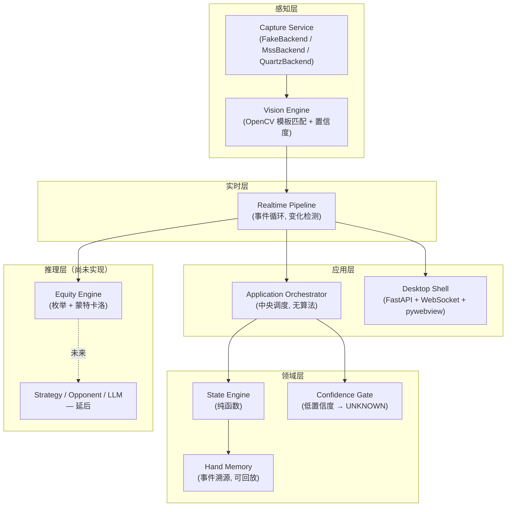

# PokerSense

[English](README.md) | **简体中文**

**一个实时德州扑克分析助手。** 它通过截屏观察牌桌，识别当前局面，计算胜率，并把结果实时显示在一个
桌面伴随窗口里——让玩家在打牌的同时就能看到胜率、街道（street）和识别置信度。

它**不是**自动打牌机器人，不会替玩家下注或做决策——它只观察和汇报，每一手牌都由真人自己打。它也不
是录像回放分析工具——这里的一切都是实时的，逐帧进行。

---

## 现在真正做到了什么

这一节故意写得很直白——下面每一条结论都是在真实硬件上独立跑通验证过的，不是"写完了就当它对"。

| 能力 | 状态 | 证据 |
|---|---|---|
| Core 领域模型（不可变值对象、`ChipAmount`/`ChipDelta`、事件溯源） | ✅ 完成 | 560+ 单元测试 |
| State Engine（纯函数状态机） | ✅ 完成 | 单元 + 集成测试 |
| Equity Engine（枚举 + 蒙特卡洛 + pot odds + 范围） | ✅ 完成 | 枚举法与蒙特卡洛在摊牌结果上交叉验证一致 |
| Confidence Gate（低置信度字段降级为 `UNKNOWN`，绝不瞎猜） | ✅ 完成 | 单元测试 |
| 截屏后端 — Windows（`MssBackend`） | ✅ 已实现 | 单元测试通过；尚未在真实 Windows 桌面上跑过 |
| 截屏后端 — macOS（`QuartzBackend`） | ✅ 已实现并验证 | 在真实硬件上截取过真实的屏幕窗口 |
| 视觉识别（OpenCV 模板匹配：牌面/街道/底池） | ✅ 已用真实像素验证 | 见下方 [真实世界视觉验证](#真实世界视觉验证) |
| 实时链路（Capture → Vision → State → Equity，单一事件循环） | ✅ 可运行 | 由真实截屏驱动，端到端跑通 |
| 桌面 UI（伴随窗口，实时刷新） | ✅ 可运行 | FastAPI + WebSocket 后端，HTML/CSS/JS 前端，已验证实时生效 |
| 打包（macOS `.dmg`、Windows 安装包 `.exe`，通过 GitHub Actions） | ✅ 可运行 | CI 构建与打 tag 发布均已成功 |
| **在任意真实扑克平台上的识别能力** | ❌ 未完成 | 见下——这是真正的下一个里程碑 |
| 策略建议 / 对手画像 / LLM 推理 / 决策输出 | ❌ 未开始 | 有意延后，见 [路线图](#路线图) |

### 真实世界视觉验证

此前所有关于 Vision Engine 的"准确率"数字，测的都是脚本生成的合成图片——从没有一张真实截图。为了
弄清楚识别代码在真实像素上到底行不行，我们渲染了一个受控的测试牌桌
（`tools/real_pipeline_smoke/mock_table.html`），把它当作一个真实的 macOS 屏幕窗口截了图，然后拿
未经任何修改的 `VisionEngine` 去识别这张真实截图：

```
hero_cards : Ah, Kh    ✓ 正确，置信度 0.95
board_cards: Qh 9h 2c 5h 7s   ✓ 正确，置信度 0.95
street     : RIVER     ✓ 由公共牌占用情况正确推导
pot        : 42        ✓ 正确，置信度 0.95
```

这是真实证据，不是合成数据自证自洽——但它**不能**证明在任何具体真实扑克客户端的牌面皮肤、布局、渲染
方式上也一样准。那一步标定工作（针对真实平台的 ROI 映射 + 模板采集）还没有做；见
[路线图](#路线图)。

---

## 架构

五层，严格单向依赖（上层依赖下层，反之不成立）：



**设计原则，按优先级排序：正确性 > 稳定性 > 可观测性 > 性能 > 功能数量。** 具体体现为：金额永远用
`decimal.Decimal`，绝不用 `float`；所有状态对象深层不可变；Vision Engine 没把握的字段一律变成
`UNKNOWN`，绝不瞎猜；每个识别器的"占用情况"和"牌面身份"这两条证据各自独立产生、互相校验，不会
被混在一起。

完整设计文档见 [`architecture.md`](architecture.md)（数据契约、面向未来推理层的 Fast/Slow path 拆分、
以及上面每条规则背后的原因）。

### 端到端数据流

```
屏幕  →  Capture Service  →  Frame
                                  │
                                  ▼
                          Vision Engine  →  RawObservation（牌面/街道/底池 + 置信度）
                                  │
                                  ▼
                        Realtime Pipeline  →  变化检测（只有真正变化才重新计算）
                                  │
                    ┌─────────────┴─────────────┐
                    ▼                             ▼
        Application Orchestrator          Equity Engine
         → State Engine → 新状态              (胜率 / 平局率)
                    │                             │
                    └─────────────┬─────────────┘
                                  ▼
                     RealtimeAnalysis（状态 + 胜率 + 置信度）
                                  │
                                  ▼
                    WebSocket  →  桌面伴随窗口
```

---

## 模块地图

| 模块 | 路径 | 负责什么 |
|---|---|---|
| Core | `src/poker_engine/core/` | 不可变领域类型：`PokerState`、`Card`、`ChipAmount`/`ChipDelta`、事件。零第三方运行时依赖。 |
| State Engine | `src/poker_engine/state_engine/` | 纯函数状态转换；拒绝非法/倒退的状态。 |
| Hand Memory | `src/poker_engine/memory/` | Append-only 事件存储；一手牌可以完整回放。 |
| Confidence | `src/poker_engine/confidence/` | 在低置信度字段驱动决策之前，把它们阻断为 `UNKNOWN`。 |
| Orchestrator | `src/poker_engine/orchestrator/` | 中央调度器；唯一同时调用 State 和 Hand Memory 的模块，不含任何算法。 |
| Perceptual — Capture | `src/poker_engine/perceptual/capture/` | `FakeBackend`（测试用）、`MssBackend`（Windows）、`QuartzBackend`（macOS）——都实现同一个 `CaptureService` 接口。 |
| Perceptual — Vision | `src/poker_engine/perceptual/vision/` | 牌面/街道/底池识别器（OpenCV 模板匹配）、ROI 映射、每个检测器各自的置信度标定。 |
| Equity | `src/poker_engine/equity/` | 牌力评估、枚举法、蒙特卡洛、pot odds、范围胜率。 |
| Realtime | `src/poker_engine/realtime/` | 把 capture → vision → state → equity 串起来的事件循环，带变化检测，避免空闲帧也触发重算。 |
| Desktop | `src/poker_engine/desktop/` | FastAPI 服务（提供 UI、通过 WebSocket 推送 `RealtimeAnalysis`）+ 一个 `pywebview` 原生窗口外壳。 |
| UI | `ui/` | 伴随窗口本体——纯 HTML/CSS/JS，无构建步骤，无外部依赖。 |

更深入的设计文档在 [`docs/`](docs/) 目录下：`core-contracts.md`、`state-engine.md`、
`vision-engine.md`、`confidence-gate.md`、`hand-memory.md`、`orchestrator.md`、
`capture-and-table-mapping.md`、`serialization.md`、`tech-stack-matrix.md`，以及
[`docs/adr/`](docs/adr/) 里的架构决策记录。

---

## 快速上手

需要 Python 3.11.x（固定版本，见 `pyproject.toml`）。

```bash
# 核心引擎 + 测试
pip install -e ".[dev]"
make test
make lint

# 屏幕截取（Windows 上装 mss，macOS 上装 pyobjc/Quartz）
pip install -e ".[dev,perceptual]"

# 桌面 App（装 FastAPI、uvicorn、pywebview）
pip install -e ".[dev,desktop]"
make run-desktop           # 打开原生伴随窗口
make run-desktop-server    # 只启动服务，浏览器打开 http://127.0.0.1:8765

# 打包成独立 App（装 PyInstaller）
pip install -e ".[dev,desktop,packaging]"
make package                # -> dist/PokerSense.app（macOS）或 dist/PokerSense/（Windows）
```

现在桌面 App 里播放的是**一段写死的演示牌局**，不是真实识别——目前还没有真实的截屏识别链路接进去
（见 [路线图](#路线图)）。现在这个版本的意义在于：整条链路的每一块都是真实的、各自独立验证过的；
把它们端到端接到一张真实牌桌上，是下一步要做的事，不是已经做完的事。

CI（`.github/workflows/ci.yml`）在每次 push 时都会在 macOS 和 Windows 上跑完整测试套件 + lint。
`.github/workflows/build-desktop.yml` 会给两个平台各构建一个正式的安装包——macOS 上是 `.dmg`
（配置了 Apple 开发者签名信息时会自动签名+公证，否则是未签名版本），Windows 上是
`PokerSense-Setup.exe`（用 Inno Setup 打的正式安装向导）——打版本 tag 时（`git tag v0.1.0 &&
git push origin v0.1.0`）会自动把两个安装包发布到 GitHub Release。

---

## 路线图

刻意排了顺序，避免在没验证过的地基上继续盖楼：

1. **拿一个真实、低风险的目标先做标定** —— 挑一个不涉及真钱/ToS 法律风险的目标（详见项目讨论记录），
   采集真实截图，做真实的 ROI 标定 + 牌面模板采集，第一次测出真实世界的识别准确率。
2. **把桌面 App 接到真实截屏链路** —— 用真实的 `RealtimePipeline` 替换掉写死的演示数据流，让伴随
   窗口显示一手正在真实进行的牌局。
3. **Equity 性能优化** —— 蒙特卡洛路径是延迟瓶颈（纯 Python，几百毫秒量级），需要换成 C 级别的
   evaluator 或做向量化。
4. **策略建议 / 对手画像 / 决策输出** —— 故意放在最后。在识别还没被证明可靠之前就给出行动建议是
   真实的风险（见 `architecture.md` 里"策略建议后置于正确性"的规则）——Vision 必须先值得信任。
5. **正式分发** —— 签名/公证的正式构建、自动更新、通过 `configs/platform/` 适配器模式支持多平台
   牌面皮肤。

---

## 项目约定

- 金额永远通过 `ChipAmount`（非负）/ `ChipDelta`（可正负）用 `decimal.Decimal` 表示——绝不用
  `float`。
- 时间戳永远是带时区信息的 `datetime`；不用"假值兜底"（falsy-fallback）这种写法。
- Core 领域对象深层不可变（`tuple`、`frozenset`、`MappingProxyType`，不允许可变容器泄漏出去）。
- Vision Engine 没把握读对的字段会变成 `UNKNOWN`，而不是猜一个——宁可什么都不显示，也不显示错的。
- 这个仓库里不存在 AI 代理的流程仪式（任务计划、自检报告、带版本号的结果快照）——git 历史本身就是
  "改了什么、为什么改"的唯一真源；这些上下文写在 commit message 里。
